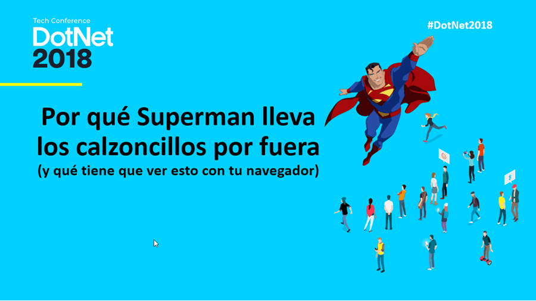

# Advanced image and video manipulation with pure CSS and JavaScript
## Ejemplos de código de la ponencia de José Manuel Alarcón en la DotNet2018

>Con los actuales navegadores Web es posible llevar a cabo cuestiones relacionadas con los gráficos y el vídeo, que eran impensables hasta hace tan solo unos pocos años. Teniendo claros unos mínimos conceptos, se pueden conseguir cosas alucinantes sin apoyarse en plugins ni bibliotecas, tan solo con unas pocas líneas de JavaScript puro. Descubriremos cómo hacerlo y de paso aprenderemos algunas cosas interesantes de la historia de la tecnología.

### Referencias:
- [Quora: Why does Superman wear his underwear on the outside?](https://www.quora.com/Why-does-Superman-wear-his-underwear-on-the-outside/answer/Ariel-Williams) – Ariel Williams
- [Take Photos and Control Camera Settings](https://developers.google.com/web/updates/2016/12/imagecapture) - Google Developers
- [Polyfill para ImageCapture en Firefox](https://github.com/GoogleChromeLabs/imagecapture-polyfill)
- [Accelerated Shape Detection in Images - Draft, 4 April 2018](https://wicg.github.io/shape-detection-api/) – WICG (Web Incubator Community Group)

### Cursos de campusMVP relacionados que podrían interesarte:
- [Especialista en programación Web con HTML5, CSS3, JavaScript y jQuery](https://www.campusmvp.es/catalogo/Product-Especialista-en-programaci%C3%B3n-Web-con-HTML5,-CSS3,-JavaScript-y-jQuery_235.aspx)
- [Programación avanzada con JavaScript y ECMAScript](https://www.campusmvp.es/catalogo/Product-Programación-avanzada-con-JavaScript-y-ECMAScript_206.aspx)
